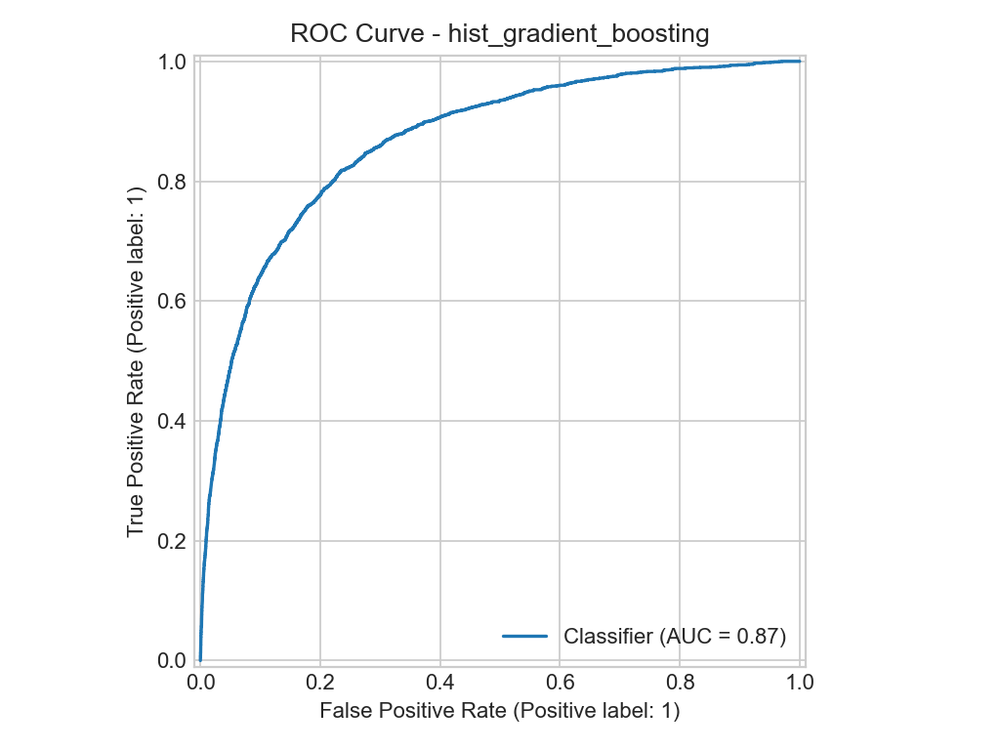
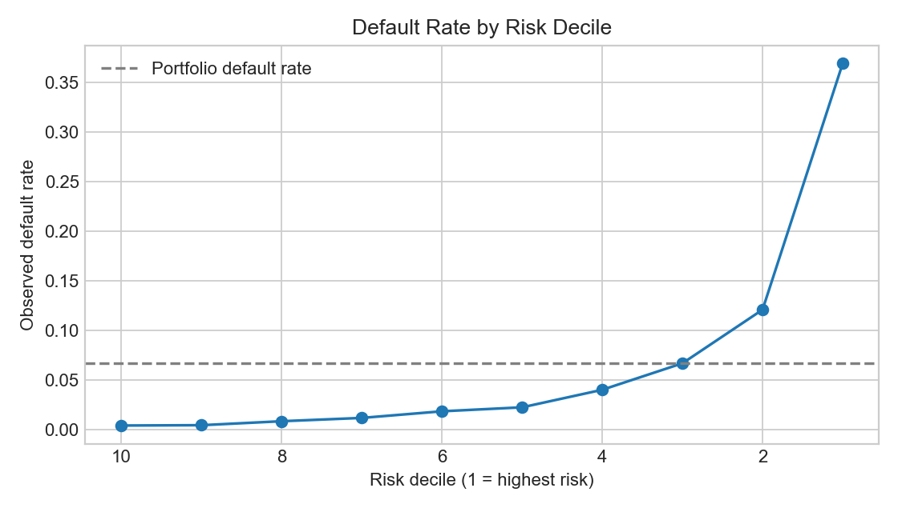
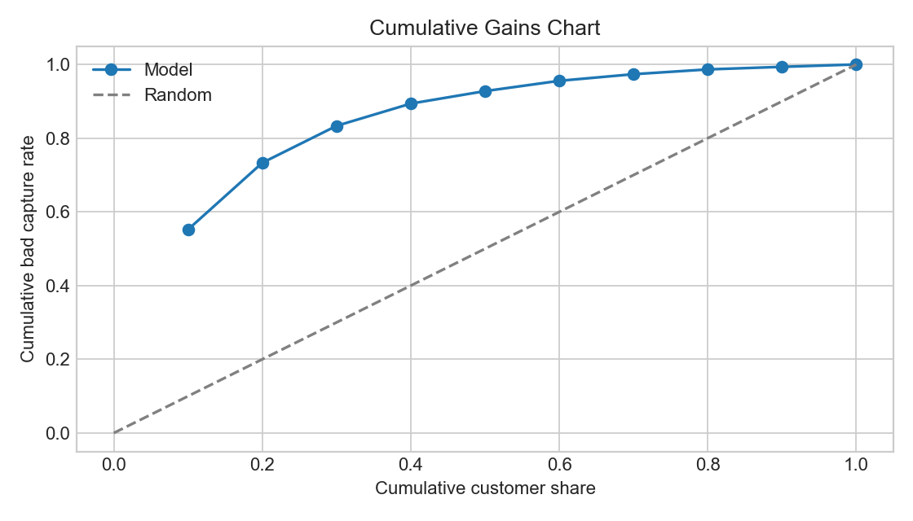
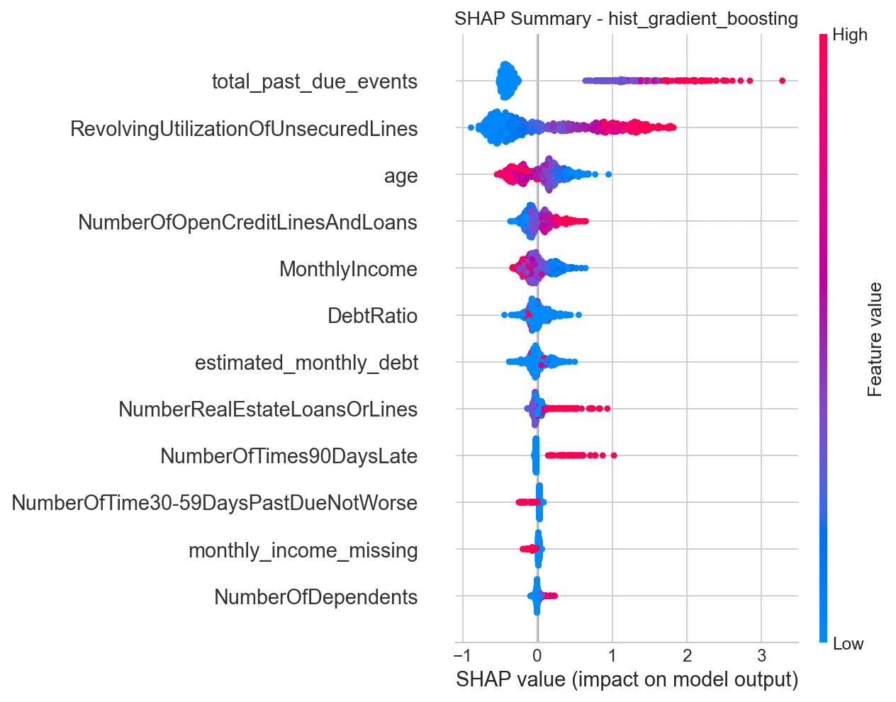
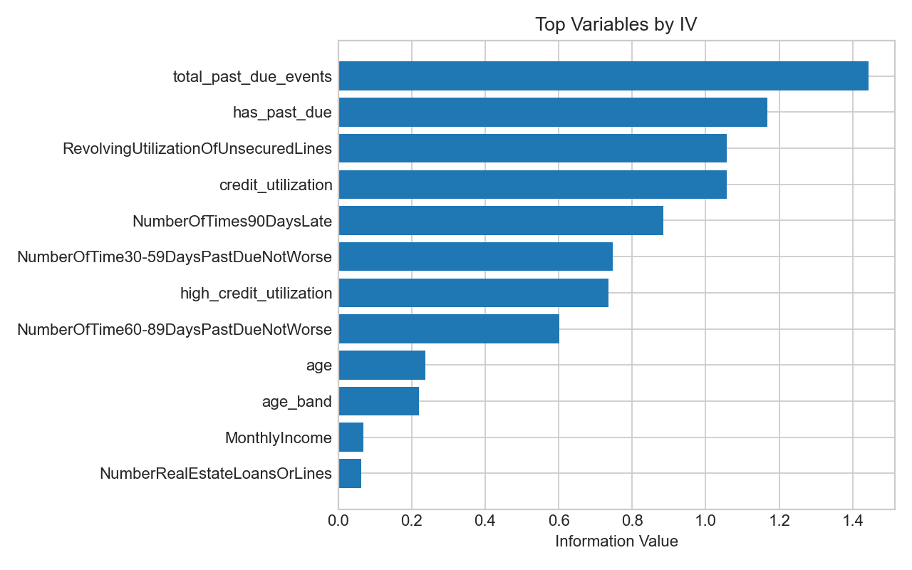
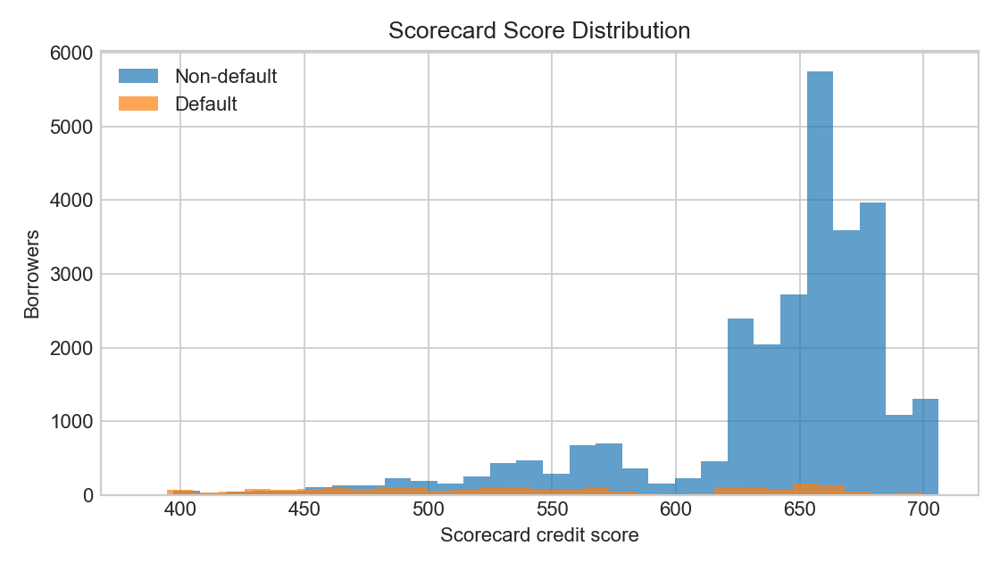
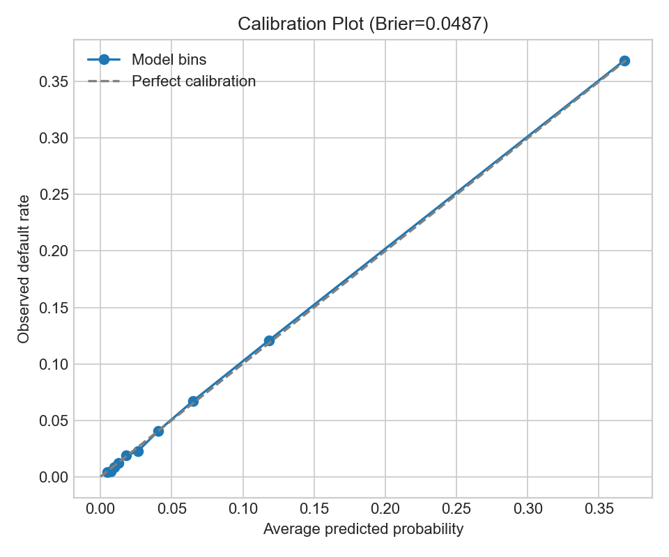

# Portfolio Credit Risk Report

## Executive Summary

This project builds a credit default risk analytics workflow using the Kaggle **Give Me Some Credit** dataset. The objective is to predict whether a borrower will experience serious delinquency within the next two years and translate the model output into practical risk-management decisions.

The best-performing model is **Histogram Gradient Boosting**, with **AUC 0.868** and **KS 0.583** on the holdout sample. The model is especially useful for risk ranking: the highest-risk 10% of borrowers captures **55.21%** of all observed defaults, with **5.52x lift** versus the portfolio average.

Key business implication: the model can support targeted manual review, risk-based approval thresholds, and borrower-level risk explanation. A WOE logistic scorecard benchmark is also included to compare the machine learning champion with a more traditional and interpretable credit-risk approach.

## Business Objective

Credit lenders need to make approval and review decisions before the actual repayment outcome is known. A useful credit risk model should answer four questions:

- Which borrowers are most likely to become seriously delinquent?
- Which borrower attributes drive default risk?
- How much risk can be captured by reviewing only the highest-risk applicants?
- How should approval thresholds balance growth and default-risk control?

The target variable is `SeriousDlqin2yrs`, where `1` indicates serious delinquency within the next two years.

## Data and Feature Engineering

The raw dataset contains 150,000 borrowers and 12 original columns. The observed default rate is approximately **6.68%**, so the modeling task is naturally imbalanced.

Feature engineering focused on interpretable credit-risk signals:

| Feature Group | Examples | Business Meaning |
|---|---|---|
| Credit utilization | `RevolvingUtilizationOfUnsecuredLines`, high-utilization flag | Measures credit line usage pressure |
| Past-due behavior | 30-59, 60-89, 90+ day late counts; total past-due events | Captures delinquency history |
| Debt burden | `DebtRatio`, estimated monthly debt, debt-to-income proxy | Measures repayment pressure |
| Income and capacity | `MonthlyIncome`, income bands, missing-income flag | Captures repayment capacity and information quality |
| Credit depth | open credit lines, real estate loans | Captures credit history and exposure complexity |

## Model Performance

Three models were trained and compared using AUC and KS. AUC measures ranking quality across thresholds. KS measures separation between defaulters and non-defaulters, which is commonly used in credit-risk scorecard evaluation.

| Model | Role | AUC | KS |
|---|---|---:|---:|
| Histogram Gradient Boosting | ML champion | 0.868 | 0.583 |
| Random Forest | Nonlinear baseline | 0.864 | 0.582 |
| Logistic Regression | Linear baseline | 0.863 | 0.572 |

The three models perform similarly, but Histogram Gradient Boosting provides the strongest overall ranking performance. Logistic Regression remains useful as a transparent baseline, while Random Forest provides a tree-based comparison point.

## Risk Segmentation and Lift

The model ranks borrowers from highest predicted risk to lowest predicted risk, then divides them into ten equal-sized deciles. This shows whether the model can concentrate future defaults into a small review population.

| Risk Group | Borrowers | Observed Defaults | Default Rate | Cumulative Defaults Captured | Lift |
|---:|---:|---:|---:|---:|---:|
| Top 10% | 3,000 | 1,107 | 36.90% | 55.21% | 5.52x |
| Top 20% | 6,000 | 1,470 | 24.50% | 73.32% | 3.67x |
| Top 30% | 9,000 | 1,671 | 18.57% | 83.34% | 2.78x |

The top-risk decile alone captures more than half of all observed defaults. This means the model can be used to prioritize manual review or enhanced verification for a limited group of borrowers instead of reviewing the entire portfolio.

## Approval Threshold Trade-off

The approval threshold converts a predicted default probability into a business decision. Borrowers below the threshold are treated as approved, while borrowers above the threshold are rejected or routed to manual review.

| Approval Threshold | Approved Borrowers | Rejected / Manual Review | Default Rate Among Approved | Default Rate Among Rejected | Defaults Captured by Rejection |
|---:|---:|---:|---:|---:|---:|
| 0.3 | 94.25% | 5.75% | 4.28% | 46.11% | 39.65% |
| 0.5 | 97.87% | 2.13% | 5.52% | 59.94% | 19.10% |
| 0.7 | 99.76% | 0.24% | 6.52% | 72.60% | 2.64% |

A lower threshold is more conservative: it sends more applicants to rejection or manual review and captures more future defaulters. A higher threshold approves more borrowers but allows more default risk into the approved population.

The threshold should not be selected by model metrics alone. In a real lending setting, the final cutoff should consider expected loss, approval revenue, manual review capacity, and business risk appetite.

## Explainability: SHAP and IV

Two complementary explainability approaches were used:

- **SHAP** explains the machine learning champion by measuring which variables most influence predictions.
- **Information Value (IV)** measures the discriminatory power of variables in a traditional credit-risk / scorecard framework.

Top SHAP drivers:

| Risk Driver | Mean Absolute SHAP | Source |
|---|---:|---|
| Total past-due events | 0.602 | Engineered |
| Revolving credit utilization | 0.595 | Raw |
| Age | 0.237 | Raw |
| Open credit lines and loans | 0.138 | Raw |
| Monthly income | 0.132 | Raw |
| Debt ratio | 0.090 | Raw |

Top IV variables:

| Risk Variable | IV | Interpretation |
|---|---:|---|
| Total past-due events | 1.443 | Very strong risk signal |
| Has any past-due history | 1.167 | Very strong risk signal |
| Credit utilization | 1.057 | Very strong risk signal |
| 90+ days late count | 0.884 | Very strong risk signal |
| 30-59 days late count | 0.747 | Very strong risk signal |
| Age | 0.238 | Medium signal |

SHAP and IV point to consistent business themes: prior delinquency, high credit utilization, age, income, and debt burden are the most important risk drivers. Very high IV values should be reviewed carefully before production use because they may indicate redundancy, overly dominant variables, or possible leakage-like behavior.

## Scorecard Benchmark

A WOE logistic scorecard was built as a traditional interpretable benchmark. The goal was not to beat the machine learning champion, but to show how a more transparent scorecard compares against the best predictive model.

Selected scorecard variables:

- Total past-due events
- Credit utilization
- Age
- Monthly income
- Real estate loans or lines
- Income band
- Debt-to-income proxy
- Open credit lines and loans

| Model | Role | AUC | KS | AUC Gap vs Champion |
|---|---|---:|---:|---:|
| WOE Logistic Scorecard | Traditional interpretable benchmark | 0.826 | 0.519 | -0.042 |
| Histogram Gradient Boosting | Machine learning champion | 0.868 | 0.583 | 0.000 |

The scorecard is less predictive than the machine learning champion, but it is easier to explain. This comparison illustrates a practical trade-off in credit risk modeling: stronger predictive performance versus simpler policy communication.

## Calibration

The model's Brier score is **0.0487**. The calibration table shows that predicted default probabilities are close to observed default rates across score bands, especially in the high-risk segment.

| Score Band | Avg Predicted PD | Observed Default Rate | Prediction Error |
|---:|---:|---:|---:|
| 1 | 0.50% | 0.43% | 0.06% |
| 5 | 1.78% | 1.87% | -0.08% |
| 8 | 6.49% | 6.70% | -0.21% |
| 10 | 36.79% | 36.90% | -0.11% |

Calibration matters when model scores are interpreted as probabilities or used in expected-loss calculations.

## Limitations and Next Steps

Limitations:

- The dataset is public and historical, so it may not reflect a current lender portfolio.
- The model does not fully address reject inference because outcomes are only observed for borrowers present in the dataset.
- Approval thresholds are evaluated using risk metrics, not full profitability or expected-loss economics.
- Fairness, stability, and production monitoring are outside the current project scope.

Next steps:

- Validate the model on lender-specific data.
- Add expected-loss analysis using PD, LGD, exposure, approval revenue, and review cost.
- Monitor population stability, score drift, calibration drift, and realized default rate over time.
- Add segment-level fairness and policy review before any production use.

## Conclusion

The project demonstrates a full credit-risk analytics workflow: risk feature engineering, model comparison, model explainability, scorecard benchmarking, risk segmentation, calibration, and approval-threshold analysis. The champion model provides strong risk ranking, while the scorecard benchmark and SHAP/IV analysis make the results more interpretable for credit-risk stakeholders.
